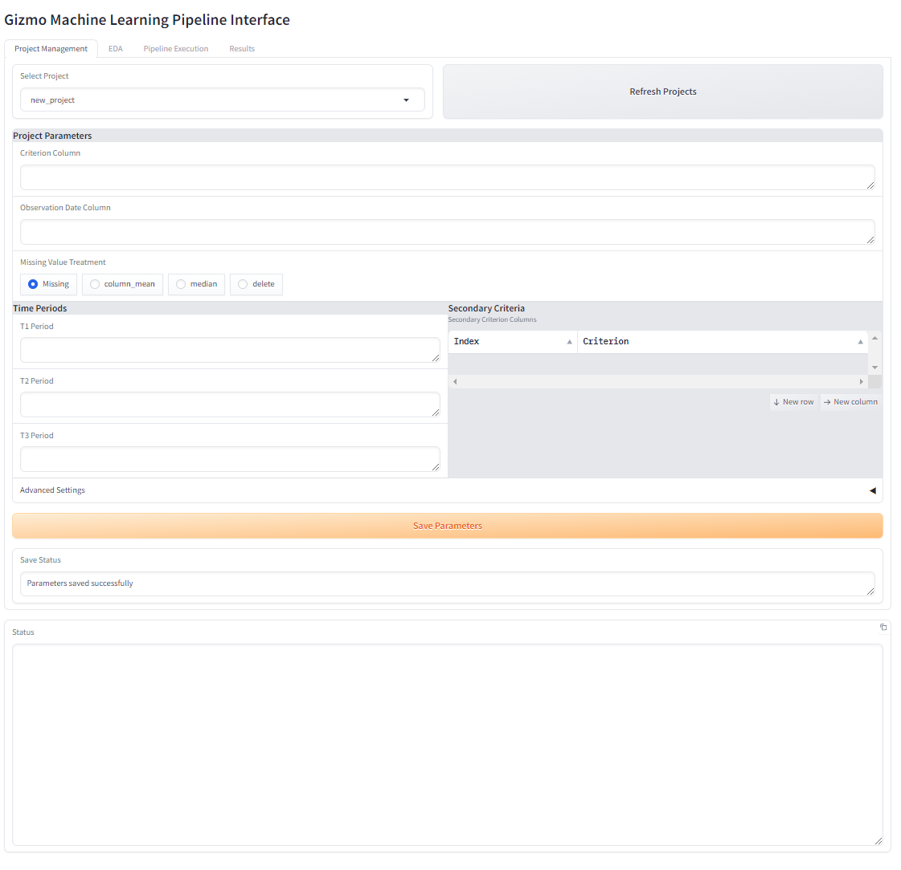
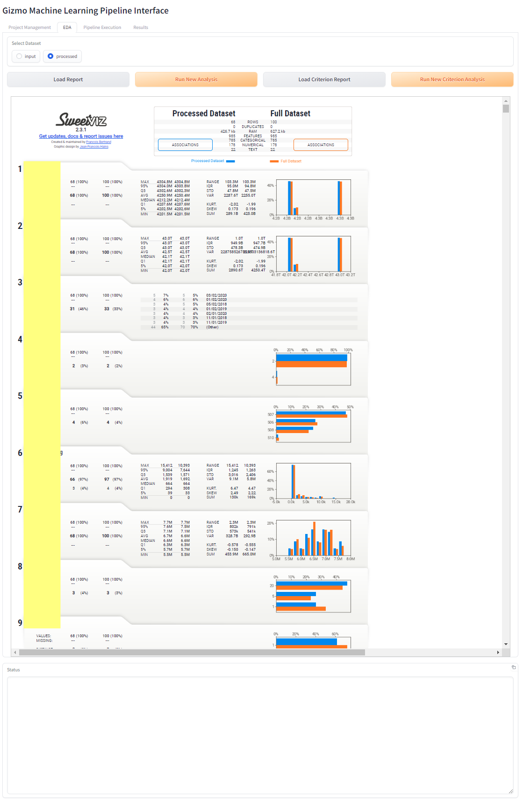

<p align="center">
  
</p>

# Gizmo Project
### Automated Machine Learning Pipeline with Interactive UI


Gizmo is an end-to-end machine learning automation tool that streamlines the entire process from data preparation to model evaluation. With its intuitive GUI, you can manage projects, prepare data, train models, and generate comprehensive reports with just a few clicks.

## 🌟 Key Features

- **Interactive GUI**: User-friendly interface for all ML pipeline stages
- **Automated Data Preparation**: Handles missing values, outliers, and feature engineering
- **Multi-Model Training**: Supports XGBoost, Random Forest, and more
- **Comprehensive Reporting**: Generates detailed reports with visualizations and metrics
- **Exploratory Data Analysis**: Built-in EDA tools with sweetviz integration

## 📸 Screenshots

### Project Management
Easily manage your ML projects, configure parameters, and set up data processing rules.


### Exploratory Data Analysis
Analyze your data with interactive visualizations and detailed statistics.


## 🚀 Getting Started

### Prerequisites
- Python 3.9
- Conda package manager

### Installation

1. **Clone the repository**
```bash
git clone https://github.com/SikamikanikoBG/GIZMO.git
cd gizmo
```

2. **Set up the environment**
```bash
# On Linux/Mac
bash setup.sh

# On Windows
setup.bat
```

3. **Activate the environment**
```bash
conda activate gizmo_ar
```

## 📚 Usage

### Using the GUI

1. **Launch the interface**
```bash
python gizmo_ui.py
```

2. **Navigate through the tabs:**
   - **Project Management**: Configure project parameters and settings
   - **EDA**: Perform exploratory data analysis on your datasets
   - **Pipeline Execution**: Run data preparation and model training
   - **Results**: View and compare model performance

### Command Line Interface

For automated workflows, use the CLI:

```bash
# Data preparation
python main.py --project my_project --data_prep_module standard

# Model training
python main.py --project my_project --train_module standard

# Model evaluation
python main.py --project my_project --eval_module standard --session SESSION_ID
```

## 🛠️ Pipeline Stages

### 1. Data Preparation
- Handles missing values with configurable strategies
- Removes outliers automatically
- Creates derived features
- Supports temporal data splitting

### 2. Model Training
- **Supported Models**:
  - XGBoost
  - Random Forest
  - Decision Trees
  - Logistic Regression
- Automatic hyperparameter optimization
- Cross-validation support

### 3. Evaluation
- Comprehensive metrics calculation
- ROC curves and confusion matrices
- Detailed performance reports
- Model comparison tools

## 💻 System Requirements

### Minimum
- RAM: 8 GB
- CPU: 2 cores
- Storage: 20 GB

### Recommended
- RAM: 16 GB
- CPU: 4+ cores
- Storage: 50 GB SSD

## 🤝 Contributing

Contributions are welcome! To contribute:

1. Fork the repository
2. Create a feature branch
```bash
git checkout -b feature/amazing-feature
```
3. Commit your changes
4. Push to your branch
5. Open a Pull Request

## 📄 License

This project is licensed under the MIT License - see the [LICENSE](LICENSE) file for details.

## 🙏 Acknowledgments

- Thanks to all contributors who have helped shape this project
- Built with [Gradio](https://gradio.app/) for the UI
- Uses [Sweetviz](https://github.com/fbdesignpro/sweetviz) for EDA reports